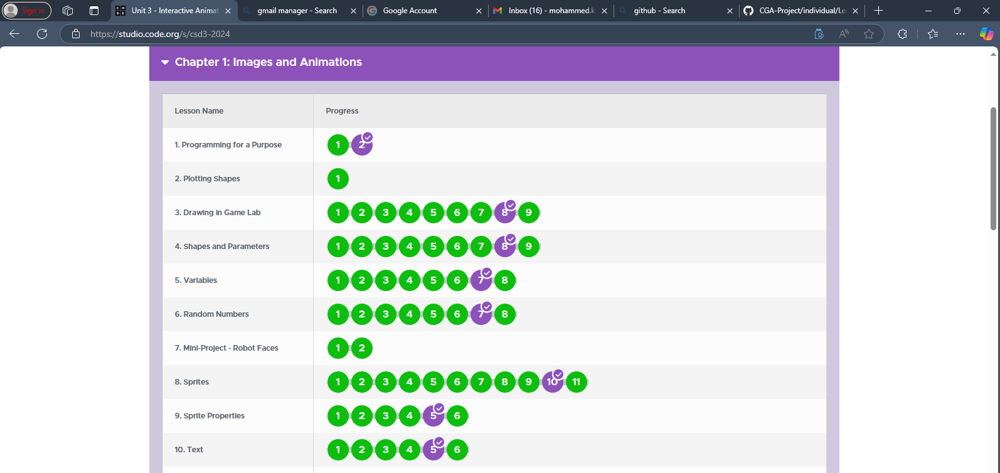

#### Name: Mohammed Kasim

#### ID: UGR/25433/14 

## Lesson 1: Programming for a Purpose

Question of the day: How can we design animations and games based on the needs of a user? Refer to your activity guide to recommend templates to clients.

-   Checked out the activity guide
-   Based on the Activity guide I  :
         - completed the word puzzle and tried to find words. 
         - tried to check the animation and game design template but I didn't get the point.
         - 
-   Completed the survey

## Lesson 2: Plotting Shapes
Question of the Day: How can we clearly communicate how to draw something on a screen?

-   After this lesson I was:
         - able to understand ho to instruct the game lab to display on the screen.
         - able to drag and drop shapes on the screen.

## Lesson 3: Drawing In Game Lab
Question of the Day: How can we communicate to a computer how to draw shapes on the screen?

-   After this lesson I was:
         - able to understand how to draw polygon shapes using functions like rect() and ellipse().
         - able to fill the shapes with different color on the screen.
## Lesson 4: Shapes and Parameters
Question of the Day: How can we use parameters to give the computer more specific instructions?

  After this lesson I was:
         - able to understand specific parameters that used to specifically design a shape.
         - able to undersatnd the polygon() function that can be used to draw a polygon of any shape.

## Lesson 5: Variables
Question of the Day: How do variables help manage data in programs?
 
 After this lesson I understood that:

        - Variables store information that can change as the program runs.
        - They are used for tasks such as tracking scores, user inputs, or program settings.
 Activities:
        - Creating and updating variables in animations and games.
        - Using variables for interactivity, such as event counting.
## Lesson 6: Random Numbers
 Question of the Day: How do random numbers add dynamism to programs?
 
 After this lesson I understood that:

       - Random numbers introduce variation and unpredictability.
       - They are useful for randomizing movements, creating challenges, or changing colors.
 Activities:
       - Generating random values within a range using randomNumber(min, max).
       - Incorporating randomness in animations or interactive features.
 ## Lesson 7: Mini-Project: Robot Face
 Question of the Day: How can randomness enhance creative projects?
 
 After this lesson I understood that randomness:

       - Combines randomness with drawing shapes and positioning elements.
       - Allows for dynamic changes to a robot face design.
 Activities:
       - Designing a robot face with randomly changing features.
       - Using random numbers to adjust positions or sizes of elements.

## Lesson 8: Sprites
 Question of the Day: How are sprites used to represent objects in animations or games?
 
 After this lesson I understood that :

       - Sprites are graphical elements that can move and interact in programs.
       - They simplify complex animations and improve visuals.
 Activities:
       - Creating and customizing sprites in Game Lab.
       - Integrating sprites into interactive projects.

## Lesson 9: Sprite Properties
Question of the Day: How do sprite properties enhance animations?
 
 After this lesson I understood that :

       - Sprites have attributes like position, size, and speed that can be modified.
       - Manipulating these properties allows for dynamic animations and interactivity.
 Activities:
       - Modifying sprite properties over time.
       - Exploring behaviors like bouncing or following paths.

## Lesson 10: Testing and Debugging
Question of the Day: Why is testing essential, and how can it improve programs?
 
 After this lesson I understood that :

       - Testing ensures programs work correctly and identifies issues.
       - Debugging involves finding and fixing errors for better functionality.
 Activities:
       - Testing programs with user interactions.
       - Refining code to enhance performance and user experience.

## Lesson 11: Mini-Project - Captioned Scenes
`
background("white");
rect(100, 100, 200, 200);
rect(100, 100, 200, 200);
var sprite = createSprite(150, 200);
var sprite1 = createSprite(220,200);
sprite.setAnimation("ball1");
sprite1.setAnimation("ball2")
sprite.scale=0.1;
sprite1.scale=0.1;
text("text", 0, 15);
text("text", 0, 5);
drawSprites();

fill("black");
text("Let's collect the balls", 200, 360);
text("Pool and Baseball", 200, 390);
textSize(36);
`
## Lesson 12: The Draw Loop

// Setting Frame Rate
World.frameRate = 5;

//1) Create your sprite for the background
var bg =createSprite(200,200);
bg.setAnimation("background");

//2) Create your sprites for the cow, elephant, and pig and set the x and y location for each.
var cow = createSprite(300, 210);

var pig = createSprite(200, 250);

var elephant = createSprite(100, 210);

//3) Set the animation for each sprite.
cow.setAnimation("cow");
pig.setAnimation("pig");
elephant.setAnimation("elephant");
//4) Resize your animals.
cow.scale = 0.5;
pig.scale = 0.3;
elephant.scale = 0.5;
//5) Update the appropriate sprite property in the draw loop to
function draw() {
  cow.y = randomNumber(150,210);
  pig.y = randomNumber(150,210);
  elephant.y = randomNumber(150,210);
  drawSprites();
}

//make the animals appear like they are jumping on the couch like the image

## Lesson 13: Sprite Movement

Spinnig:

var pan = createSprite(200, 200);
pan.setAnimation("pan");

function draw() {
  background("palegreen");
  //1) Make the pan spin like in the image
  pan.rotation= pan.rotation + 1;
  drawSprites();
}

Assesment:

var orangeFish = createSprite(400, randomNumber(0, 100));
orangeFish.setAnimation("orange_fish");
var blueFish = createSprite(250, randomNumber(0, 200));
blueFish.setAnimation("blue_fish");
var greenFish = createSprite(300, randomNumber(200, 300));
greenFish.setAnimation("green_fish");

function draw() {
  // Draw Background
  background("navy");
  
  // Update Values
  orangeFish.x = orangeFish.x - 2;
  
  //1) Use the counter pattern to make the blue fish move across the screen faster than the other fish
   blueFish.x = blueFish.x - 3;
  //2) Use the counter pattern to make the green fish move across the screen slower than the other fish.
  greenFish.x = greenFish.x - 1;
  // Draw Animations
  drawSprites();
}

## Lesson 14: Mini-Project - Animation

background(rgb(40,0,0));
var landscape = createSprite(200, 170);
var higher = createSprite(300, 240);
var lower = createSprite(100, 300);

higher.setAnimation("higher_robot");
lower.setAnimation("lower_robot");

higher.scale = 0.3;
lower.scale = 0.2;

higher.tint = "blue";
lower.tint = "brown";

landscape.setAnimation("landscape");
landscape.scale = 1.13;
landscape.tint = "red";

function draw() {
    background("white");
    higher.y = higher.y -0.4;
    lower.rotation = randomNumber(5,-5);
    drawSprites();
    textSize(26);
    fill("white");
    text("It is over Anakin!", 100, 360);
    text("I have the high ground", 65, 390);
}

## Lesson 15:  Conditionals

var soup =  createSprite(200,200);
soup.setAnimation("stew");

function draw() {
  background("lightgreen");
  soup.rotation = soup.rotation + 3;
  
  //2) Add a conditional that detects when the bowl is upside down.
  if (soup.rotation > 90) {
    //3) Set the sprite's animation to be an empty bowl when the bowl is upside down.
    soup.setAnimation("bowl");
  }
  
  
  drawSprites();
}

## Lesson 16: Keyboard Input

Question of the Day: How can our programs react to user input?

After this lesson I understood that:
   - The keyDown() block allows interaction through keyboard input.
   - Responding to user input makes programs more dynamic and engaging.
   - 
Activities: 
   - Prediction: Consider how keyboard input can enhance program interactivity.
   - Skill Building: Learn to use the keyDown() block to respond to user actions. 
   - Practice: Create programs that respond to various key inputs.
   - Assessment: Demonstrate understanding by creating an interactive program utilizing keyboard input.
   - Challenges: Explore creative and advanced applications of keyboard interactivity.

## Lesson 17: Mouse Input
Interactive Animation and Effects
This series of small programs demonstrates how to create interactive animations using conditional statements (if-else), mouse events, and sprite manipulation with tools like World.mouseX and World.mouseY.

Key Features:
If-Else Statements for Animation Direction:

Gears spin in one direction when a condition (like pressing the space bar or mouse click) is true.
- Gears spin in the opposite direction when the condition is false.
- Mouse Events:

Using mouseDown to trigger animations.
- Sprites respond differently based on mouse button presses or the lack of user input.
- Mouse Position Detection:

- Using World.mouseX and World.mouseY to track the mouse position.
- Sprite behavior changes dynamically based on which side of the screen the mouse pointer is located.

## Lesson 18: Project - Interactive Card
var backgroundSprite = createSprite(200,200);
backgroundSprite.setAnimation("space");

var vase = createSprite(350, 350);
var flower1 = createSprite(50, 300);
var flower2 = createSprite(150, 300);
var flower3 = createSprite(250, 300);

vase.setAnimation("vase");
vase.visible = false;
flower1.setAnimation("flower");
flower2.setAnimation("flower");
flower3.setAnimation("flower");

flower1.tint= 'red';
flower2.tint= 'blue';
flower3.tint= 'green';

flower1.scale = 0.4;
flower2.scale = 0.4;
flower3.scale = 0.4;

function draw() {
  background("white");

  // Mouse click interaction for hiding flowers
  if (mouseDown("leftButton")) {
    // Check if the mouse is within the bounds of each flower
    if (World.mouseX > 0 && World.mouseX < 100 && World.mouseY > 250 && World.mouseY < 350) {
      flower1.visible = false;
    }
    if (World.mouseX > 100 && World.mouseX < 200 && World.mouseY > 250 && World.mouseY < 350) {
      flower2.visible = false;
    }
    if (World.mouseX > 200 && World.mouseX < 300 && World.mouseY > 250 && World.mouseY < 350) {
      flower3.visible = false;
    }
  }

  // Show the vase and flowers once they are all hidden
  if (!flower1.visible && !flower2.visible && !flower3.visible) {
    vase.visible = true;
    flower1.x = 340;
    flower2.x = 350;
    flower3.x = 360;
    flower1.visible = true;
    flower2.visible = true;
    flower3.visible = true;
    flower1.scale = 0.2;
    flower2.scale = 0.2;
    flower3.scale = 0.2;
  }

  drawSprites();
}

## Lesson 19: Velocity
Learning Insights:
-  Automating Movement:
     Using velocityX and velocityY simplifies motion by automatically updating a sprite’s position without needing to manually calculate and update each frame.

- Continuous Rotation:
    By using rotationSpeed, you can easily create continuous rotations without having to increment the rotation manually.
  
## Lesson 20: Collision Detection

  - Collision Detection: Utilize isTouching to determine if two sprites collide and trigger actions such as halting movement or changing sprite animations.
  - Debugging: Activate sprite debugging by setting sprite.debug = true to visualize sprite boundaries.
  - Movement Control: Employ arrow keys or assign velocities to move sprites and interact with others.
## Lesson 21:  Mini-Project - Side Scroller

- This mini-project demonstrates a game created using the skills learned in the past three lessons. It integrates sprite creation, collision detection, velocity adjustments, and interactive gameplay elements like scoring and health tracking.

Key Features:

- Game Setup:

  - Created sprites for a frog (player), a fly (target), and a mushroom (obstacle).
  - Added animations and velocities to the sprites.

- Sprite Interactions:
 
  - When the frog touches the mushroom (obstacle), health decreases, and the mushroom rotates. 
  - When the frog touches the fly (target), the score increases, and the fly resets its position.
- Movement and Jumping:

  - The frog jumps when the up arrow is pressed and falls back when it reaches the jump height limit.
  - Gravity effect applied to stop or reverse velocity as needed.
- Looping:

- Both the fly and mushroom reappear on the right side of the screen after exiting on the left.
Scoreboard and Game Over:

- Displays health and score on the screen.
- Ends the game and displays a "Game Over" message if health reaches zero.

## Lesson 22: Complex Sprite Movement
- Learned Concept: Counter Pattern for Acceleration and Deceleration

- Gained knowledge of using the counter pattern with the velocityX block to simulate acceleration and deceleration.

var rock = createSprite(200, 50);  
rock.setAnimation("rock");  
rock.velocityY = 0.5;  

function draw() {  
  background("skyblue");  

  // 1) Increment the rock's speed as it falls to mimic acceleration.  
  rock.velocityY = rock.velocityY + 0.1;  

  drawSprites();  
}  

## Lesson 23: Collisions

- Using sprite.displace():
    - Gained experience using the displace() block to create a collision effect where one sprite pushes another.

Comparison of Collision Methods:

  - displace(): One sprite pushes the other without changing its own velocity.
  - collide(): Stops movement when two sprites collide but does not push them apart.
  - bounce(): Causes both sprites to bounce off each other while conserving velocity.
  - bounceOff(): Makes a sprite bounce off another while keeping the second sprite stationary.

Collider Boundaries:

  - Explored how setting collider boundaries affects the behavior of these collision blocks.
  - Adjusting collider size or shape can make collisions more precise or allow specific interactions between sprites.

## Lesson 24: Mini-Project - Flyer Game

This game project showcases the application of concepts learned in the previous two lessons, including sprite interactions, velocity control, and collision handling.

Key Features:

 Game Setup:

   - Created a player sprite (fly_bot), a collectible target (coin), and moving obstacles (rock1 and rock2).
   - Assigned animations, scaling, and initial velocities.
 Player Controls:

   - Controlled the player's vertical movement using the "up" key and adjusted horizontal velocity using the "left" and "right" keys.
 Gravity Effect:

  - Applied a constant downward velocity to simulate falling, creating the challenge of maintaining the player in the air.
Obstacle Looping:

  - Implemented looping behavior for the obstacles to reappear on the opposite side when they move off the screen.
Sprite Interactions:

  - Collected the coin by touching it, resetting its position to a random location.
  - Used displace() to mimic the obstacles pushing the player upon contact.
Game Over Condition:

  - Triggered a game over screen if the player moves outside the playable area.

    ## Lesson 25:  Functions

    Learned Concept: Using Functions in Game Lab

Understanding Functions:

Learned how to create reusable blocks of code using the function keyword in Game Lab.
- Functions make the code modular and reusable, allowing for a cleaner and more organized program.
- Functions in the Code:

   - drawBackground(): Draws the sky and grass for the scene.
   - drawTrees(): Draws tree trunks and branches using rectangles and polygons.
   - drawClouds(): Draws clouds in the sky using semi-transparent ellipses.
   - drawFence(): Draws a white picket fence using lines for posts and rails.
Using Functions:

   - Functions are called in a specific order to render the scene correctly.

## Lesson 26: The Game Design Process

Arcade Game: Applied All Learned Concepts

This arcade game demonstrates the integration of concepts such as sprite creation, movement, collisions, scoring, and custom game mechanics, creating an engaging experience.
Key Features:

- Sprites and Animations:

   - Player: Moves in all directions using arrow keys and displays directional animations (alienWalkRight).
   - Cake: A target to be defended from the enemies.
   - Enemies: Two moving sprites (ladybug) with randomized initial positions.
- Background:

   - Dynamic background created using rect() and fill() to simulate ground and water.
- Game Mechanics:

   - Player Movement: Controlled using arrow keys and mirror effects for realistic animation.
- Enemy Interactions:
   - Enemies eat the cake, reducing the score and incrementing the cakeEaten counter.
   - Enemies displace the player on collision.
   - If enemies touch water, the player gains points, and enemies reset.
- Game Over:

   - Triggered when the cakeEaten counter reaches 3.
Score Display:

   - Score updates dynamically based on gameplay actions and is displayed on the screen.

## Lesson 27: 
// Variables
var score = 0;

// Create Sprites
var platform1 = createSprite(100, 100);
platform1.setAnimation("platform");
platform1.velocityY = 3;

var platform2 = createSprite(300, 300);
platform2.setAnimation("platform");
platform2.velocityY = 3;

var item1 = createSprite(randomNumber(30, 370), randomNumber(30, 370));
item1.setAnimation("star");
item1.velocityY = 5;

var item2 = createSprite(randomNumber(30, 370), randomNumber(30, 370));
item2.setAnimation("star");
item2.velocityY = 5;

var item3 = createSprite(randomNumber(30, 370), randomNumber(30, 370));
item3.setAnimation("star");
item3.velocityY = 5;

var player = createSprite(200, 0);
player.setAnimation("alien");
player.velocityY = 2;

function draw() {
  if (score > 10) {
    background2();
  } else {
    background1();
  }

  playerLands();
  controlPlayer();
  collectItems();
  playerFall();
  loopPlatforms();
  loopItems();
  drawSprites();
  showScore();
}

// Functions
function background1() {
  background("darkBlue");
  noStroke();
  fill("yellow");
  ellipse(randomNumber(0, 400), randomNumber(0, 400), 3, 3);
  ellipse(randomNumber(0, 400), randomNumber(0, 400), 3, 3);
  ellipse(340, 50, 60, 60);
  fill("darkBlue");
  ellipse(320, 30, 60, 60);
}

function background2() {
  background("darkBlue");
  fill(rgb(180, 0, 0));
  ellipse(30, 185, 100, 100);
  fill(rgb(50, 50, 210));
  ellipse(350, 305, 140, 140);
}

function showScore() {
  fill("white");
  textSize(20);
  text("Score: ", 20, 30);
  text(score, 80, 30);
}

function loopPlatforms() {
  if (platform1.y > 400) {
    platform1.y = 0;
  }
  if (platform2.y > 400) {
    platform2.y = 0;
  }
}

function loopItems() {
  if (item1.y > 400) {
    item1.y = 0;
  }
  if (item2.y > 400) {
    item2.y = 0;
  }
  if (item3.y > 400) {
    item3.y = 0;
  }
}

function playerFall() {
  player.velocityY = player.velocityY + 0.1;
}

function controlPlayer() {
  if (keyDown("left")) {
    player.x = player.x - 2;
  }
  if (keyDown("right")) {
    player.x = player.x + 2;
  }
  if (keyWentDown("up")) {
    player.velocityY = -5;
  }
}

function playerLands() {
  player.collide(platform1);
  player.collide(platform2);
}

function collectItems() {
  if (player.isTouching(item1)) {
    setItem1();
    score = score + 1;
  }
  if (player.isTouching(item2)) {
    setItem2();
    score = score + 1;
  }
  if (player.isTouching(item3)) {
    setItem3();
    score = score + 1;
  }
}

function setItem1() {
  item1.x = randomNumber(30, 370);
  item1.y = 0;
}

function setItem2() {
  item2.x = randomNumber(30, 370);
  item2.y = 0;
}

function setItem3() {
  item3.x = randomNumber(30, 370);
  item3.y = 0;
}

## Lesson 28: Project - Design a Game

// Variables
var redScore = 0;
var blueScore = 0;

// Create Sprites
var player1 = createSprite(100, 200);
player1.setAnimation("robot");
player1.tint = "black";
player1.scale = 0.2;

var player2 = createSprite(300, 200);
player2.setAnimation("robot");
player2.tint = rgb(0, 0, 100);
player2.scale = 0.2;

var ball = createSprite(200, 200);
ball.setAnimation("football");
ball.scale = 0.1;
ball.velocityX = 5;

createEdgeSprites();

function draw() {
  // Draw background
  background1();

  // Update sprites
  controlPlayer();
  gameLogic();
  spriteInteraction();
  showScore();
  drawSprites();
}

// Functions
function background1() {
  fill(rgb(230, 0, 0));
  stroke("white");
  strokeWeight(5);
  rect(0, 0, 200, 400); // Red side

  fill(rgb(0, 0, 100));
  stroke("white");
  strokeWeight(5);
  rect(200, 0, 400, 400); // Blue side

  fill(rgb(1, 120, 210));
  ellipse(200, 200, 100, 100); // Center circle
}

function controlPlayer() {
  // Player 2 (Arrow keys)
  if (keyDown("up")) {
    player2.y = player2.y - 2;
  }
  if (keyDown("down")) {
    player2.y = player2.y + 2;
  }
  if (keyDown("left")) {
    player2.x = player2.x - 2;
  }
  if (keyDown("right")) {
    player2.x = player2.x + 2;
  }

  // Player 1 (WASD keys)
  if (keyDown("w")) {
    player1.y = player1.y - 2;
  }
  if (keyDown("s")) {
    player1.y = player1.y + 2;
  }
  if (keyDown("a")) {
    player1.x = player1.x - 2;
  }
  if (keyDown("d")) {
    player1.x = player1.x + 2;
  }
}

function spriteInteraction() {
  // Ball interactions
  ball.bounceOff(player1);
  ball.bounceOff(player2);
  ball.bounceOff(edges);
}

function gameLogic() {
  // Scoring logic
  if (ball.isTouching(rightEdge)) {
    redScore += 1;
    ball.x = 200;
    ball.y = 200;
    ball.velocityX = -5;
  }

  if (ball.isTouching(leftEdge)) {
    blueScore += 1;
    ball.x = 200;
    ball.y = 200;
    ball.velocityX = 5;
  }
}

function showScore() {
  // Display scores
  fill("white");
  stroke(rgb(1, 120, 210));
  strokeWeight(2);
  textSize(24);

  text("Blue:", 220, 30);
  text(blueScore, 300, 30);

  text("Red:", 20, 30);
  text(redScore, 100, 30);
}

